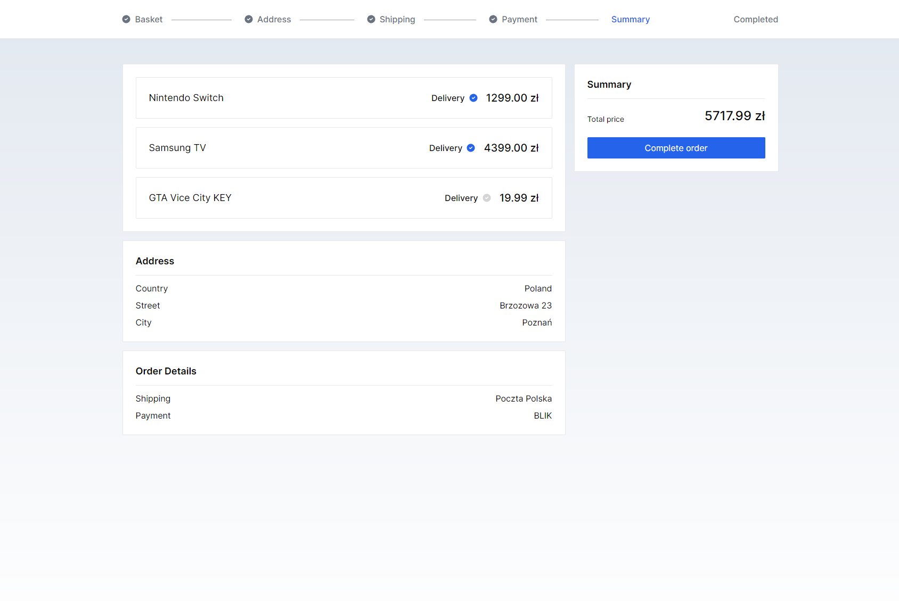

# Basket Cart Application

This repository contains the frontend application for a simple shopping system built using React/Next.js and state management with xState.

## Deployment
This application is deployed on Vercel. You can access the live deployment [here](https://basket-cart.vercel.app/).

## Getting Started

To run this application locally, follow these steps:

1. Clone this repository to your local machine:

```bash
  git clone https://github.com/energywraith/basket-cart.git
```

2. Navigate to the project directory.
3. Create a `.env.local` file in the root directory of the project.
4. In the `.env.local` file, set the `API_URL` variable to the URL of your backend API. For example:

```
  API_URL=http://localhost:8000
```

5. Install dependencies using npm:

```bash
  npm install
```

6. Start the application:

```bash
  npm run dev
```

Open [http://localhost:3000](http://localhost:3000) with your browser to see the result.

## Preview
